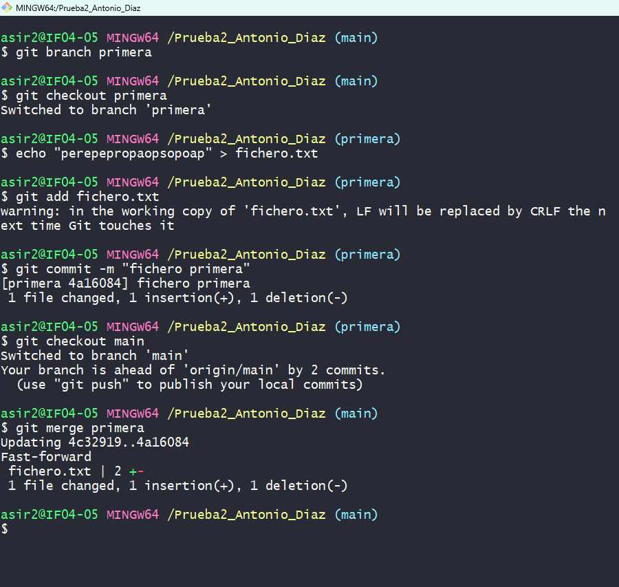
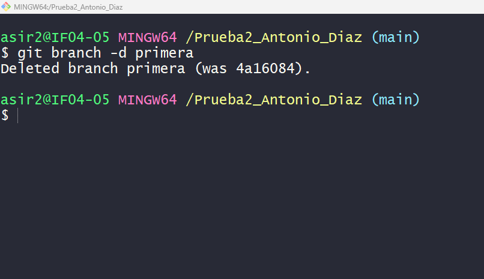
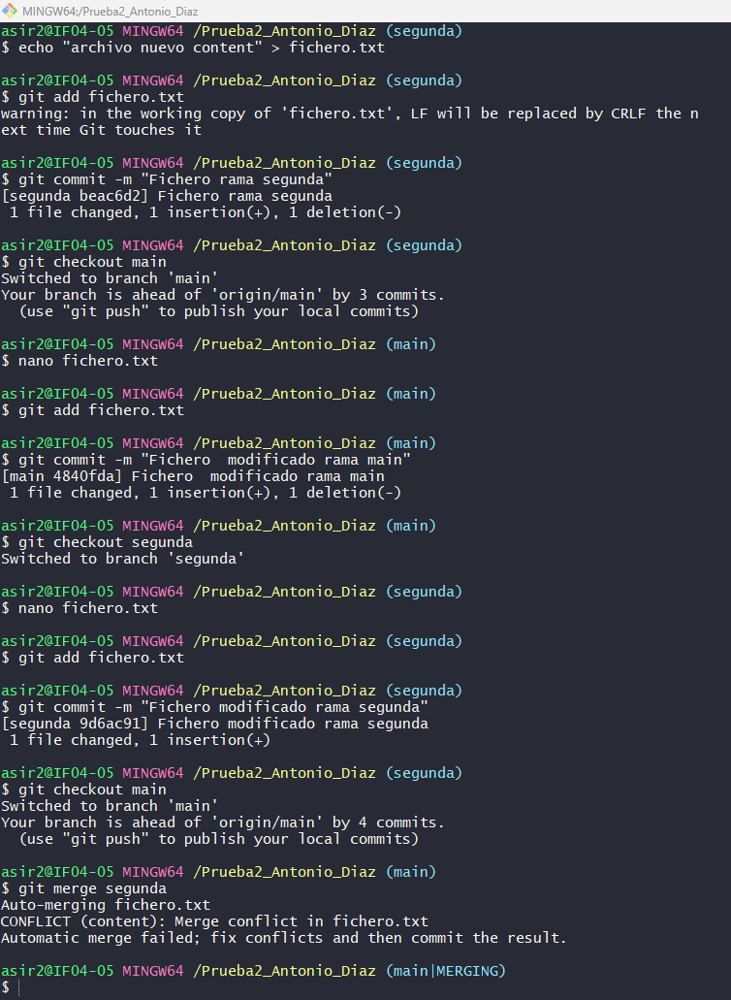
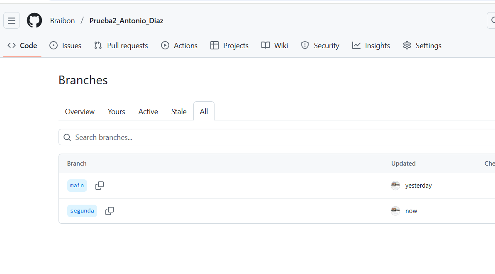

# Creacion de ramas en Git

## Creación de una rama

Empezaremos creando una rama llamada `primera` con el comando `git branch primera`, despues  haremos un `git branch` para comprobar que se ha creado correctamente, tiene que quedar tal que así:

## Creacion de fichero y fusión de ramas

Ahora vamos a crear un nuevo fichero en la rama `primera` y despues vamos a fusionarla con la rama principal `main`.
Debería verse algo como esto:

Respondiendo a la pregunta de si se produce un conflicto la respuesta es **NO**, ya que hemos creado un fichero en una rama y en la otra no le hemos modificado ni tocado nada del archivo, por lo tanto, cuando las fusionamos no sucede ningún conflicto ya que el fichero está solo en la rama `primera`. Y como en la otra no hay ningún fichero  con el mismo nombre, no crea conflicto.

## Borrar la rama

Vamos a borrar la rama que hemos creado previamente con el comando `git branch -d primera`, se deberiar ver de está manera:

## Creación de una segunda rama y creación de conflicto

Ahora vamos a a hacer como en el paso anterior y crearemos una rama, en este caso la llamaremos `segunda` pero esta vez vamos a crear un conflicto.
Para ello vamos a seguir los siguientes pasos:
1. Crearemos un fichero en la rama `segunda` con el comando `echo`
2. Haremos un `git add fichero.txt` y un `git commit` para confirmar los cambios.
3. Luego cambiaremos a la rama `main` 
4. Modificaremos el archivo con `nano`
5. Volveremos a hacer un `git add fichero.txt` y un `git commit` para confirmar los cambios.
6. Despues volvemos a la rama `segunda` y hacemos lo mismo que en los pasos **4 y 5**
7. y ahora volvemos a la rama `main` y con un `git merge segunda` fusionaremos las dos ramas y nos dará el conflicto deseado, tiene que quedar de este modo:

## Solución del conflicto y sincronización de la rama en GitHub

La solución mas sencilla es borrar el archivo y crear uno de la misma manera que lo hicimos en en segundo apartado.

Despues iremos a GitHub y sincronizaremos a la rama `segunda` en nuestro repositorio remoto, debe de quedar algo parecido a esto:
