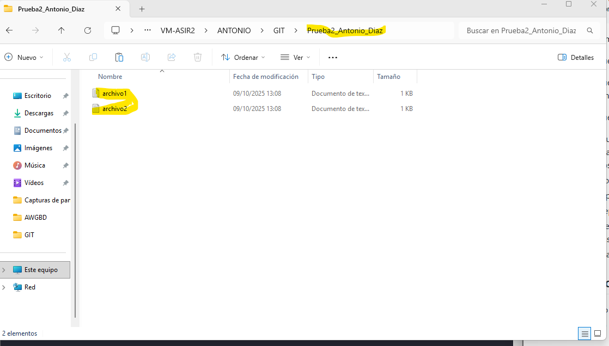

# Creación del repositorio "Prueba2_Antonio_Diaz"

## Creación repositorio local
Para crear el repositorio local, el cual tiene dos archivos de texto ("archivo1" y "archivo2"), debemos usar el comando git init y acontinuacion el nombre que le queramos poner al repositorio, en mi caso lo hice tal que así:

## Conectar el repositorio local con uno remoto en GitHub

Para ello necesitaremos usar el comando "git remote add origin "URL del repositorio en GitHub"", tiene que quedar algo como esto:

## Subir el repositorio local a GitHub con sus cambios

Lo tendremos que hacer mediante el comando "git push", esto nos va a servir también para subir los cambios que hagamos en el mismo, en mi caso, subire otro archivo mas llamado "archivo3", el cual he creado previamente en el repositorio local, adjunto imagen

Cuando pongamos el comando nos debería salir lo siguiente:

## Clonar el repositorio en Debian

para ello debemos introducir en la consola de debian elsiguiente comando: "git clone "URL del depositorio"". 
una vez lo ejecutemos se tendría que ver tal que así:

## Actualizar la versión local del repositorio de Debian

Cuando tengmaos todo subido tal y como queremos en el repositorio, debemos hacerque el repositorio del Debian se actualice también, lo haremos con el comando "git pull" estando dentro del repositorio local, debe salir lo siguiente al ejecutarlo:

